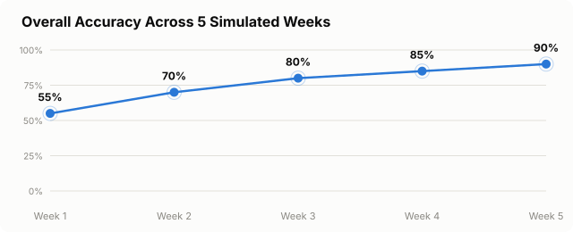
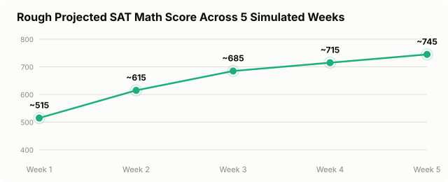
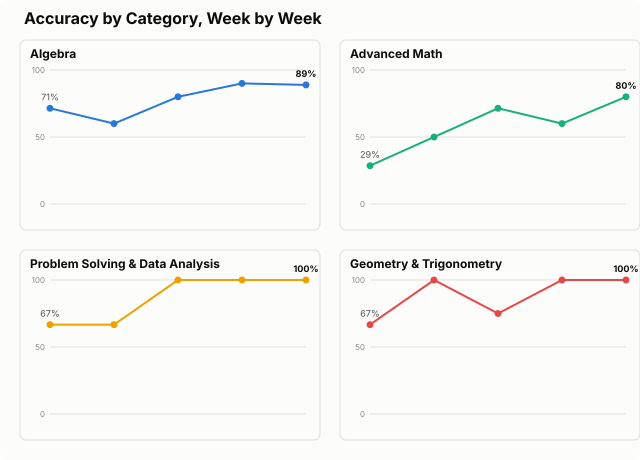

# Simulated Study Impact Report

**Question:** does this tool actually help a student improve, or does it just look good in a demo?

**Method, in one sentence:** an LLM agent role-played an average 10th-grade student across 5 simulated weeks —
a cold diagnostic, then four more rounds, each one a fresh 20-question test taken after reviewing real output
from this site's *actual deployed* AI Tutor (not a mock) on the previous round's mistakes.

**Headline result:** accuracy climbed **55% → 70% → 80% → 85% → 90%** over the 5 rounds, with a classic
diminishing-returns shape — large early gains, smaller gains later — and the improvements traceable to
specific tutored mistakes rather than a suspicious across-the-board jump.

Read [Limitations](#limitations--how-not-to-over-read-this) before citing any number in here — this is a
directional signal from one simulated student, not a controlled study.

---

## Results at a glance







| Week | Score | Accuracy | Est. raw /44 | Rough projected SAT Math score |
|---|---|---|---|---|
| 1 (baseline, cold) | 11/20 | 55% | ~24 | ~515 |
| 2 | 14/20 | 70% | ~31 | ~615 |
| 3 | 16/20 | 80% | ~35 | ~685 |
| 4 | 17/20 | 85% | ~37 | ~715 |
| 5 | 18/20 | 90% | ~40 | ~745 |

Over the full simulation: **+35 percentage points, a rough +230-point projected score gain.** Note the shape,
not just the endpoints — each week's *gain* shrinks (+15, +10, +5, +5), which is what real skill acquisition
looks like, not a straight line to 100%.

---

## Methodology

1. **Generated five independent 20-question sets**, one per simulated week, from this site's own procedural
   question bank ([`generator.js`](../generator.js)), each an SAT-weighted mix across all four content
   domains. Different specific numbers every week — no repeated questions across the whole simulation.

2. **Defined a persona** once, at the start: an average U.S. 10th grader who finished Algebra 1 with a
   B-/C+, is mid-way through Geometry, and hasn't taken Algebra 2 or Precalculus yet — with named strengths
   (basic linear equations/functions, basic geometry with given numbers) and named weaknesses (exponent
   rules, absolute value, inequality sign-flipping, factoring quadratics, right-triangle trig, reading
   scatterplots, and — it turned out over the course of the simulation — negative-number sign errors more
   broadly).

3. **The same agent ran the entire simulation**, resumed from its own transcript each week rather than
   restarted fresh, so it stayed in character and only "knew" what its persona had actually been taught by
   that point — never given the answer key, ever.

4. **Every week followed the same real loop:**
   - Attempt 20 new, unseen questions in character, writing brief in-character "work" — including the
     mistake itself where one was made.
   - Score against the real generator-computed answer key.
   - Call the *live deployed* Cloudflare Worker's `explain` mode on a realistic sample of that week's misses
     (not all of them — real students don't review every mistake), plus the real `summary` mode (the actual
     "Get My AI Study Plan" feature).
   - Carry that real tutoring content into the next week's attempt as "what the persona just reviewed,"
     alongside an explicit instruction to show realistic, uneven improvement — not instant mastery — and to
     let un-reviewed weak spots keep showing up.

   All tutoring calls are genuine HTTP requests to the production endpoint
   (`sat-math-tutor.ritvikshah.workers.dev`), the same one the live site calls.

Raw inputs/outputs for every week are in [`data/`](data/): scored question-by-question results
(`batchA_scored.json` through `batchE_scored.json`, weeks 1–5) and the actual tutor responses used each week
(`tutoring_output_week1.json` through `tutoring_output_week4.json` — week 5 had no follow-up tutoring since
the simulation ended there). [`all_rounds_summary.json`](data/all_rounds_summary.json) is the aggregated
category-by-week table the charts above are built from.

---

## Category breakdown, week by week

| Category | Wk 1 | Wk 2 | Wk 3 | Wk 4 | Wk 5 |
|---|---|---|---|---|---|
| Algebra | 71% (5/7) | 60% (3/5) | 80% (4/5) | 90% (9/10) | 89% (8/9) |
| Advanced Math | 29% (2/7) | 50% (2/4) | 71% (5/7) | 60% (3/5) | 80% (4/5) |
| Problem Solving & Data Analysis | 67% (2/3) | 67% (4/6) | 100% (4/4) | 100% (3/3) | 100% (2/2) |
| Geometry & Trigonometry | 67% (2/3) | 100% (5/5) | 75% (3/4) | 100% (2/2) | 100% (4/4) |

**Read this table with the small-N caveat front of mind** — most categories have 2–10 questions in any given
week, so a couple of flipped answers swings the percentage 10–20 points. Algebra dipping in week 2 and
Advanced Math dipping in week 4 are exactly the kind of noise you'd expect from a real learning curve, not
evidence the tutoring made anything worse. The trend that holds up across the whole simulation is Advanced
Math's steady net climb (29% → 80%) — the category the persona was weakest in at baseline, and the one the
tutoring content spent the most weeks on.

## What the tutoring actually fixed — and what took repetition

The most informative evidence isn't the topline score, it's which specific mistakes recurred and which
didn't. This table was built by grep-ing every week's scored results for each mistake pattern, not from
memory — so it only claims what the data actually shows, including where there simply wasn't a
later-week question of the same type to confirm whether something was truly fixed.

| Mistake | Weeks it appeared | Outcome |
|---|---|---|
| Exponent rules (add vs. multiply powers) | Wrong ×2 in Wk 1. Reappeared Wk 2, 3, 5. | **Fixed after one round** — correct in all 4 later appearances. |
| "Greatest value" misread on absolute value | Wrong ×1 in Wk 1 (a 2nd Wk 1 instance was already correct). Reappeared Wk 2, 3, 4×4, 5×2. | **Fixed after one round** — correct in all 8 later appearances. |
| Sine ratio: opposite/adjacent mixed up | Wrong in Wk 1. Tutored. Wrong again, same exact error, in Wk 3. | **Unresolved as measured** — never appeared again in Wk 4 or 5, so there's no later data point to confirm whether a 3rd correction would have stuck. Recorded here as-is rather than assumed fixed. |
| Inequality sign-flip dividing by a negative | Wrong in Wk 1 (didn't flip when it should have). Tutored. Wrong again in Wk 2 — a *different* error this time (flipped when it shouldn't have). No Wk 3 instance. | **Fixed by Wk 4** — correct in all 3 later appearances (Wk 4, 5×2). Took two rounds of tutoring, and the two mistakes weren't even the same misconception. |
| Two-step percent (markup × discount, not −) | Wrong in Wk 2. No Wk 1 instance. | **Fixed after one round** — correct in all 3 later appearances (Wk 3, 4×2). |
| Quadratic factoring, sign error in factor pair | Wrong in Wk 2. Tutored in Wk 3's review. | **Only one data point total** — this exact question shape never recurred in Wk 3–5, so this can't be scored as "fixed," just "not seen again." |
| Polynomial subtraction, missed one sign flip | Wrong in Wk 4 — first time this exact shape appeared at all. | **Only one data point total**, and it's a *new* mistake, not a recurring one — nothing to compare it to. |
| Function evaluation with negative inputs, sign/arithmetic slips | Correct Wk 1. Wrong Wk 2 (sign error). Wrong Wk 3 (different sign error). Wrong ×2 of 3 in Wk 4 (one sign error, one a `5²=10` arithmetic slip — not the same mistake type). Correct ×2 of 2 in Wk 5. | **Real signal of gradual improvement**, but the errors weren't all the same misconception — this reads as a broad "carelessness with negatives" tendency across several problem types, not one fixable rule, which is consistent with it taking the longest to taper off. |

Two honest takeaways, not one tidy one:

- **Isolated, single-rule errors** (a specific exponent rule, a specific misreading, a specific percent
  calculation) tended to resolve after exactly one round of tutoring, when there was a later question to
  check against.
- **The one pattern with real multi-week evidence of a slow fade** — sign/arithmetic slips on negative
  numbers in function evaluation — didn't look like one bug with one fix. It showed up as different specific
  errors (a multiplication sign, a squaring mistake) across different problem types, and only fully cleared
  up by week 5. That's a more honest picture of "a sloppy habit takes longer to fix" than the neater
  single-concept story would suggest — several of the other "did it recur?" questions above simply don't have
  enough repeated exposure in this dataset to answer at all.

---

## Limitations — how not to over-read this

- **An LLM persona is not a real student.** It "learned" by reading tutoring text once per week and
  immediately applying it in the very next context window — no forgetting curve, no need for spaced
  repetition, none of the cognitive load or distraction a real teenager has between practice sessions. Real
  human retention across 5 weeks is almost certainly weaker and slower than this. **Treat the full climb to
  90% as an optimistic upper bound** on what 5 focused sessions could do, not a realistic average outcome —
  and note that even in this optimistic simulation, the negative-number sign-error pattern took until week 5
  to fully clear up and the trig opposite/adjacent mistake was never confirmed fixed at all (see the mistake
  table above), which is closer to how real learning actually goes than the single-topic fixes that resolved
  in one round.
- **The score conversion is a rough approximation, not a real score.** The digital SAT is adaptive — Module 2
  difficulty depends on Module 1 performance — so there's no single fixed conversion table, and College Board
  doesn't publish one. Real scores could differ by 30+ points from any figure above, independent of any
  tutoring effect, and that uncertainty compounds across 5 estimated points rather than just one.
  Additionally, because the digital SAT is adaptive, a real student's *later* weeks would face
  harder-or-easier Module 2 questions depending on their Module 1 performance — this simulation used a flat
  difficulty distribution every week, which a fixed-form practice tool (like this one) also does, but an
  adaptive real SAT would not.
- **N=20 per week is small**, and category sub-counts (2–10 per category per week) are smaller still — see
  the breakdown table's own caveat above. Five weeks of a noisy 20-question measurement is a trend, not five
  precise data points.
- **Not every miss got individually reviewed each week** (a realistic sample was tutored, matching how a real
  student would actually use the "ask AI to explain" feature) — a more thorough student might see a different,
  possibly larger, result.
- **Five rounds is still not real long-term practice.** No multi-week gaps, no interference from schoolwork or
  other subjects, no true spaced-repetition schedule — just five consecutive simulated sessions with nothing
  in between them.

## Reproducing this

```bash
# Generate a new question batch from the live generator (Node, no browser needed):
node -e "const B = require('./generator.js'); console.log(B.generateQuestion('MIX'))"

# Hit the real deployed tutor the same way this simulation did:
curl -X POST https://sat-math-tutor.ritvikshah.workers.dev/tutor \
  -H "Origin: http://localhost:8811" -H "Content-Type: application/json" \
  -d '{"mode":"explain","context":{...},"messages":[]}'
```

Every batch in this simulation used entirely fresh random numbers — re-running this methodology will produce
a different specific trajectory, though the same category weighting and persona methodology, and (based on
this run) probably a similar diminishing-returns shape.
