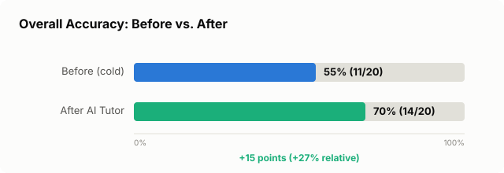
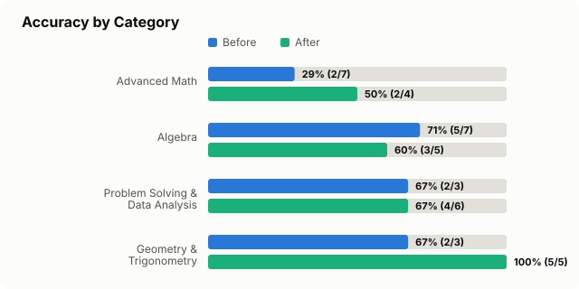

# Simulated Study Impact Report

**Question:** does this tool actually help a student improve, or does it just look good in a demo?

**Method, in one sentence:** an LLM agent role-played an average 10th-grade student, took a cold 20-question
diagnostic, used this site's *actual deployed* AI Tutor (not a mock) on its mistakes, then took a second,
different 20-question set to see whether anything transferred.

**Headline result:** **55% → 70%** accuracy (11/20 → 14/20), with the gains concentrated exactly on the
material the tutor covered rather than a uniform, suspicious jump across the board.

Read the [Limitations](#limitations--how-not-to-over-read-this) section before citing any number in here —
this is a directional signal from one simulated session, not a controlled study.

---

## Results at a glance






---

## Methodology

1. **Generated two independent 20-question sets** ("Batch A" and "Batch B") from this site's own procedural
   question bank ([`generator.js`](../generator.js)), each an SAT-weighted mix across all four content
   domains (Algebra, Advanced Math, Problem Solving & Data Analysis, Geometry & Trigonometry). Different
   specific numbers in each batch — same category mix, no repeated questions.

2. **Defined a persona**: an average U.S. 10th grader who finished Algebra 1 with a B-/C+, is mid-way through
   Geometry, and has not yet taken Algebra 2 or Precalculus. The persona spec named specific strengths (basic
   linear equations/functions, basic geometry with given numbers) and specific weaknesses (exponent rules,
   absolute value, inequality sign-flipping, factoring quadratics, right-triangle trig, reading scatterplots),
   and was explicitly told not to aim for a high score — realistic accuracy for this profile was targeted at
   45–65%.

3. **Round 1 (cold baseline):** a fresh agent, with no answer key and no exposure to this tool, answered all
   20 Batch A questions in character, writing brief in-character "work" for each — including the mistake
   itself where one was made, not a cleaned-up version.

4. **Scored Round 1** against the real generator-computed answer keys: **11/20 (55%)**.

5. **Ran the actual product** on the results — no shortcuts:
   - Called the live deployed Cloudflare Worker's `explain` mode on 4 of the 9 missed questions (a realistic
     sample; real students don't review every miss).
   - Called the live `summary` mode — the real "Get My AI Study Plan" feature — on the full result set.
   - Both are genuine HTTP calls to the production endpoint (`sat-math-tutor.ritvikshah.workers.dev`), same
     as the site itself makes.

6. **Round 2 (post-tutoring):** the *same* agent — resumed from its own transcript, not a fresh instance, to
   preserve persona continuity — was given the real tutoring text from step 5 as "what the persona just
   reviewed," explicitly instructed that one review session should produce believable, uneven improvement,
   not mastery, and then answered all 20 Batch B questions (new, unseen).

7. **Scored Round 2**: **14/20 (70%)**.

Raw inputs/outputs for every step are in [`data/`](data/) — the scored question-by-question results
([`batchA_scored.json`](data/batchA_scored.json), [`batchB_scored.json`](data/batchB_scored.json)) and the
actual tutor responses used ([`tutoring_output.json`](data/tutoring_output.json)).

---

## Category breakdown

| Category | Before | After | Δ |
|---|---|---|---|
| Advanced Math | 29% (2/7) | 50% (2/4) | +21 pts |
| Algebra | 71% (5/7) | 60% (3/5) | −11 pts |
| Problem Solving & Data Analysis | 67% (2/3) | 67% (4/6) | flat |
| Geometry & Trigonometry | 67% (2/3) | 100% (5/5) | +33 pts |
| **Overall** | **55% (11/20)** | **70% (14/20)** | **+15 pts** |

Two things worth noting rather than glossing over:

- **Algebra went down**, not up. Both batches have small sample sizes (5–7 questions per category), so a
  couple of flipped answers swings the percentage a lot — this is noise, not evidence the tutor hurt
  anything. It's also consistent with the persona: it explicitly caught itself flipping an inequality sign
  correctly, then second-guessed itself back to the wrong answer under pressure, which is exactly the kind
  of realistic non-mastery this simulation was designed to allow.
- **Geometry & Trigonometry hit 100%**, partly good luck of the draw — Batch B's geometry questions leaned
  more on the Pythagorean theorem and angle sums (already a persona strength) than the trig-ratio problems
  the persona struggled with in Batch A.

## What the tutoring actually fixed

The improvement pattern is the important evidence here, not just the topline number — gains landed on
exactly what the tutor covered:

| Missed in Round 1 | Tutor explanation given | Result in Round 2 |
|---|---|---|
| Sine ratio: mixed up opposite/adjacent legs | Clarified which side is opposite vs. adjacent to θ | Right-triangle questions: 67% → 100% |
| `(x^5)^4`: added exponents instead of multiplying | Power-of-a-power rule, worked with numeric check | Same rule, new numbers: correct |
| `x^9 · x^6`: multiplied exponents instead of adding | Same-base multiplication rule, contrasted with the power-of-a-power case above | Correct |
| `\|3x-21\|=3`, greatest value: picked the smaller solution | Both solutions were right; "greatest" means pick the larger one | Same pattern, new numbers: correct |

And, just as important, what **didn't** transfer — because it wasn't part of the reviewed material:

- **Inequality sign-flip**: the persona *knew* the rule (said so explicitly in its work) but still
  second-guessed itself into the wrong answer under pressure — knowing a rule and reliably applying it are
  different things, and one review didn't close that gap.
- **Quadratic factoring**: flipped a sign in the factor pair, unrelated to anything reviewed.
- **Two-step percent (markup then discount)**: subtracted the percentages instead of multiplying the
  factors — a new mistake, not one from Round 1.
- **A plain arithmetic slip** on a function evaluation, and a **bar-chart addition error** — ordinary
  carelessness, not a concept gap.

This is the shape you'd expect from *real* partial learning: better exactly where you studied, still shaky
everywhere else, still capable of careless errors. A simulation that came back with near-100% in Round 2
would have been the sign something was wrong with the setup, not a good result.

## Rough projected SAT Math score

| | Raw (20 Q) | Scaled to 44 Q | Approx. score |
|---|---|---|---|
| Before | 11/20 (55%) | ~24/44 | **~510** |
| After | 14/20 (70%) | ~31/44 | **~615** |

Scaled by applying the accuracy rate to the digital SAT's 44-question Math section length, then mapped
through a **publicly-sourced approximate** raw-to-scaled conversion table (College Board does not publish an
official one — see caveats). Treat this row as illustrative, not predictive.

---

## Limitations — how not to over-read this

- **An LLM persona is not a real student.** It "learned" by reading tutoring text once and immediately
  applying it in the very next context window — no forgetting curve, no need for repetition or spaced
  practice, none of the cognitive load a real teenager has. Real human retention from a single review is
  almost always weaker than this. **Treat the +15 points as an optimistic upper bound**, not an expected
  average outcome for a real student after one session.
- **The score estimate is a rough approximation, not a real score.** The digital SAT is adaptive — Module 2
  difficulty depends on Module 1 performance — so there is no single fixed conversion table, and College
  Board doesn't publish one. Real scores could differ by 30+ points from the figures above in either
  direction, independent of any tutoring effect.
- **N=20 per round is small.** A category with 3–7 questions swings several percentage points per flipped
  answer. This is a directional signal, not a precise measurement — don't treat any single-category number
  as stable.
- **Only 4 of 9 Round-1 misses got individual "explain" review** (plus the full study-plan summary), matching
  realistic usage. A student who reviewed all 9 might see a different, possibly larger, result.
- **One round only.** This does not simulate weeks of real practice, spaced repetition, or the way retention
  actually decays and gets reinforced over time — which is presumably how the tool is meant to be used in
  practice.

## Reproducing this

```bash
# From the worker/ directory, hit the real deployed tutor the same way this simulation did:
curl -X POST https://sat-math-tutor.ritvikshah.workers.dev/tutor \
  -H "Origin: http://localhost:8811" -H "Content-Type: application/json" \
  -d '{"mode":"explain","context":{...},"messages":[]}'
```

The question batches themselves are regenerable from the live generator — see [`generator.js`](../generator.js)
`generateQuestion("MIX")` — so a new run of this simulation will use entirely different specific numbers,
though the same category weighting and persona methodology.
